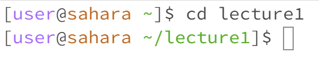
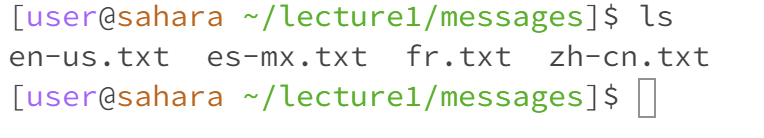
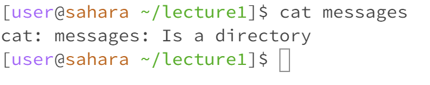

Lab Report 1

cd
1. Typing cd by itself to go back to the start
2. cd lecture1 directs you to lecture1

4. When trying to do cd fr.txt I get an error since I tried to change the directory into a txt file and a txt file is not a directory

ls
1. ls with no arguments show me lecture1 since it is the only directory in the start
2. ls with messages directory shows me en-us.txt, es-mx.txt, fr.txt, zh-cn.txt

4. ls to a txt file just points to the file itself since it's only a single file

cat
1. cat with no arguments keeps asking for input since there was no directory 
2. cat with a path to directory shows if the path is a directory

4. cat with a path to file shows the text in the file
