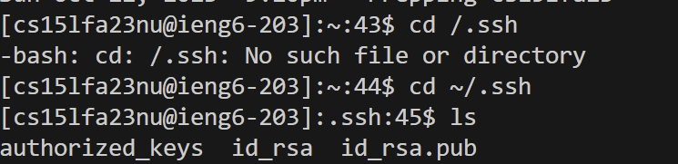

## Part 1

The method `handleRequest` is being called. The relevant arguments for handleRequest are `URI url`.
The values of the relevant fields of the class are `num`, `disnum`, and `messages`. 
The value `num` is incremented when there is an s inputted after the query.
The value`disNum` parseInt's the  value `num` into a string so it can be displayed on the website.
The value `messages` concatenates `num`, `disNum`, and the input of `parameters[1]` (which is the messages). 

The method handleRequest is being called. The relevant arguments for handleRequest are `URI url`.
The values of the relevant fields of the class are `num`, `disNum`, and `messages`.

## Part 2

This is the path to the private key.

This is the path to the public key.

This is the terminal interaction of logging into ieng6 without a password being asked.

## Part 3

In lab 2, I didn't know that I could access a terminal from a computer from a different location using ssh. 
What I also learned in lab report 3 was that I did not know I could use Java to make my own search engine.
