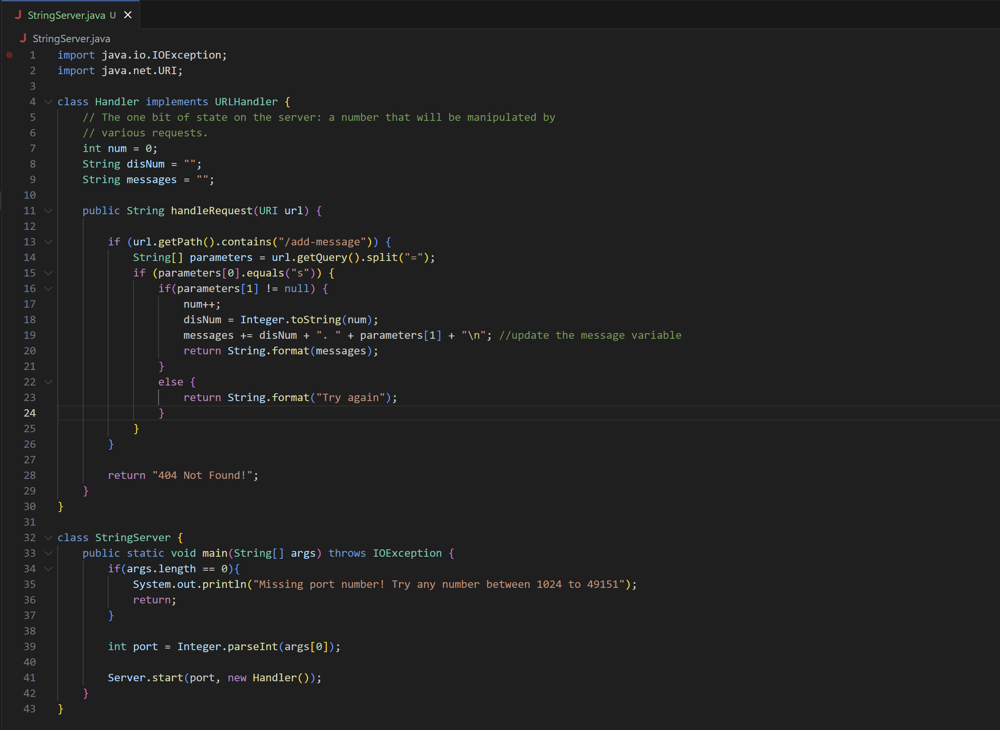
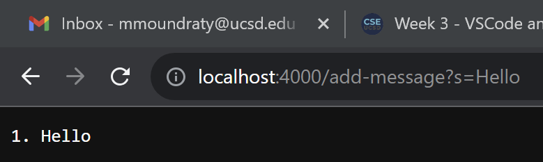
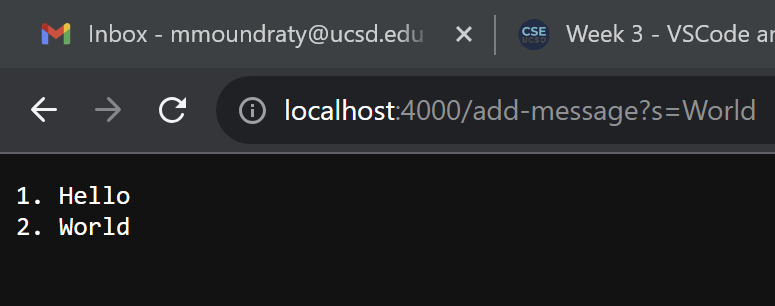
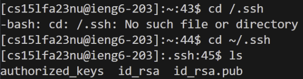
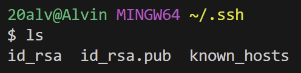
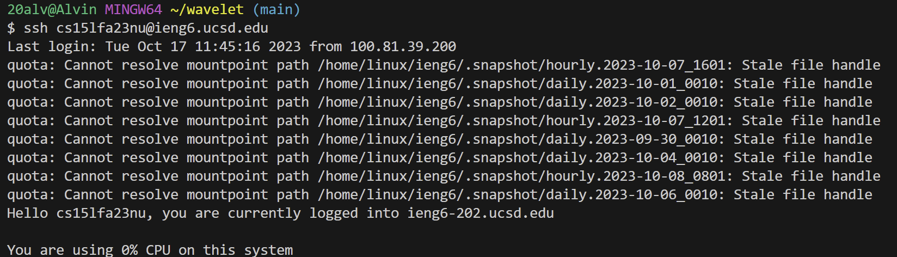
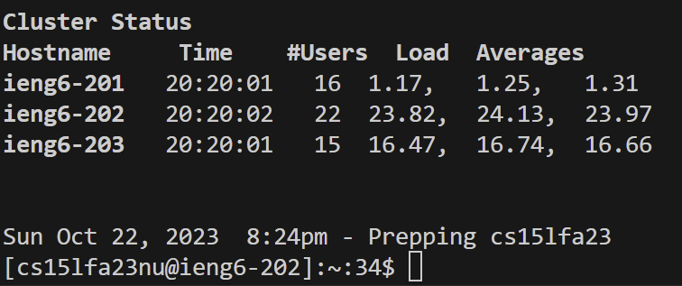

## Part 1

The method `handleRequest` is being called. The relevant arguments for handleRequest are `URI url`.
The values of the relevant fields of the class are `num`, `disnum`, and `messages`. 
The value `num` is incremented to 1 when the handlerequest is called.
The value`disNum` converts the  value `num` #1 into a string.
The value `messages` concatenate `num`, `disNum`, and the input of `parameters[1]` (which is the messages)
which will output `1. Hello` and creates a new line for the next input. 

The method `handleRequest` is being called. The relevant arguments for handleRequest are `URI url`.
The values of the relevant fields of the class are `num`, `disnum`, and `messages`. 
The value `num` is incremented to 2 when the handlerequest is called again.
The value`disNum` converts the  value `num` #2 into a string.
The value `messages` concatenates `num`, `disNum`, and the input of `parameters[1]` (which is the messages)
which will output `2. World` with the old output `1. Hello`. 

## Part 2

This is the path to the private key which is `id_rsa`

This is the path to the public key which is `ir_rsa.pub`

This is the terminal interaction of logging into ieng6 without a password being asked.

## Part 3

In lab 2, I didn't know that I could access a terminal from a computer from a different location using ssh. 
What I also learned in lab report 3 was that I did not know I could use Java to make my own search engine.
