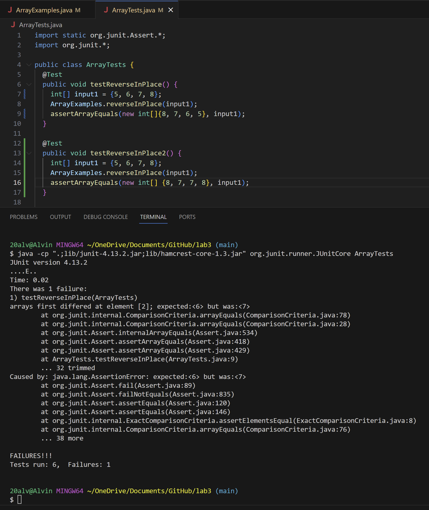

## Part 1

~~~
@Test 
public void testReverseInPlace() {
    int[] input1 = {5, 6, 7, 8};
    ArrayExamples.reverseInPlace(input1);
    assertArrayEquals(new int[]{8, 7, 6, 5}, input1);
	}
~~~

~~~
public void testReverseInPlace() {
    int[] input1 = {5, 6, 7, 8};
    ArrayExamples.reverseInPlace(input1);
    assertArrayEquals(new int[]{8, 7, 7, 8}, input1);
	}
~~~

~~~
static void reverseInPlace(int[] arr) {
    for(int i = 0; i < arr.length; i += 1) {
      arr[i] = arr[arr.length - i - 1];
    }
  }
~~~

~~~
static void reverseInPlace(int[] arr) {
    int[] newArray = new int[arr.length];
    for(int i = 0; i < arr.length; i += 1) {
      newArray[i] = arr[i];
    }
    for(int i = 0; i < arr.length; i += 1) {
      arr[i] = newArray[arr.length - i - 1];
    }
  }
~~~

The fix in the new code block addresses the issue that the array does not copy its changed elements. By creating a new array you can pick the elements that are unchanged in `newArray` into the original array in reversed order without overlapping.

## Part 2

Command for grep -c
~~~
grep -c "911" grep-results.txt
~~~

Output
~~~
17
~~~

Command for grep -c
~~~
grep -c "003" plos-sizes.txt
~~~

Output
~~~
29
~~~

Command for grep -w
~~~
grep -w "pmed" biomed-sizes.txt
~~~

Output
~~~
    345    3327   26395 technical/plos/pmed.0010008.txt
    152    1880   12791 technical/plos/pmed.0010010.txt
    148    1502   11220 technical/plos/pmed.0010013.txt
    167    1741   12743 technical/plos/pmed.0010021.txt
     82     871    6155 technical/plos/pmed.0010022.txt
     47     522    3666 technical/plos/pmed.0010023.txt
     47     489    3644 technical/plos/pmed.0010024.txt
     39     379    2882 technical/plos/pmed.0010025.txt
     85     883    6499 technical/plos/pmed.0010026.txt
    485    5254   39840 technical/plos/pmed.0010028.txt
     40     412    3003 technical/plos/pmed.0010029.txt
     46     413    3280 technical/plos/pmed.0010030.txt
    106    1110    8296 technical/plos/pmed.0010034.txt
    470    4814   36005 technical/plos/pmed.0010036.txt
    182    1976   14627 technical/plos/pmed.0010039.txt
    101    1036    7742 technical/plos/pmed.0010041.txt
    130    1431   10510 technical/plos/pmed.0010042.txt
    316    3049   24902 technical/plos/pmed.0010045.txt
     80     890    6465 technical/plos/pmed.0010046.txt
     54     579    4110 technical/plos/pmed.0010047.txt
     61     646    4590 technical/plos/pmed.0010048.txt
     53     534    4135 technical/plos/pmed.0010049.txt
     46     475    3513 technical/plos/pmed.0010050.txt
    112    1203    8433 technical/plos/pmed.0010051.txt
    195    2229   16148 technical/plos/pmed.0010052.txt
    198    2066   15878 technical/plos/pmed.0010056.txt
    195    2128   16479 technical/plos/pmed.0010058.txt
    150    1676   12102 technical/plos/pmed.0010060.txt
    101     983    7807 technical/plos/pmed.0010061.txt
    357    3709   28513 technical/plos/pmed.0010062.txt
    390    4108   30704 technical/plos/pmed.0010064.txt
    312    3123   24581 technical/plos/pmed.0010066.txt
     38     344    2572 technical/plos/pmed.0010067.txt
     39     389    2793 technical/plos/pmed.0010068.txt
     52     546    4015 technical/plos/pmed.0010069.txt
     53     549    4094 technical/plos/pmed.0010070.txt
     69     799    5565 technical/plos/pmed.0010071.txt
    143    1443   11012 technical/plos/pmed.0020002.txt
    123    1253    9682 technical/plos/pmed.0020005.txt
    144    1457   11266 technical/plos/pmed.0020007.txt
    207    2282   17517 technical/plos/pmed.0020009.txt
    294    3178   24420 technical/plos/pmed.0020015.txt
    333    3622   27409 technical/plos/pmed.0020016.txt
    209    1543   12325 technical/plos/pmed.0020017.txt
    490    4815   38176 technical/plos/pmed.0020018.txt
     46     442    3316 technical/plos/pmed.0020019.txt
     51     491    3812 technical/plos/pmed.0020020.txt
     40     383    2805 technical/plos/pmed.0020021.txt
     40     389    3005 technical/plos/pmed.0020022.txt
     46     527    3600 technical/plos/pmed.0020023.txt
     41     409    2889 technical/plos/pmed.0020024.txt
     34     307    2390 technical/plos/pmed.0020027.txt
     29     289    2045 technical/plos/pmed.0020028.txt
    114    1196    9033 technical/plos/pmed.0020033.txt
    237    2879   20355 technical/plos/pmed.0020034.txt
     74     837    6101 technical/plos/pmed.0020035.txt
     87     884    6483 technical/plos/pmed.0020036.txt
    179    1800   13754 technical/plos/pmed.0020039.txt
    222    2382   17728 technical/plos/pmed.0020040.txt
    441    4522   35552 technical/plos/pmed.0020045.txt
     52     550    4033 technical/plos/pmed.0020047.txt
     22     190    1364 technical/plos/pmed.0020048.txt
    384    4103   29053 technical/plos/pmed.0020050.txt
     76     849    6358 technical/plos/pmed.0020055.txt
    477    5141   36921 technical/plos/pmed.0020059.txt
    155    1762   12504 technical/plos/pmed.0020060.txt
    263    2752   21501 technical/plos/pmed.0020061.txt
    159    1590   11983 technical/plos/pmed.0020062.txt
     50     533    4007 technical/plos/pmed.0020065.txt
    181    1702   13417 technical/plos/pmed.0020067.txt
    200    2086   16226 technical/plos/pmed.0020068.txt
    139    1445   10897 technical/plos/pmed.0020071.txt
    559    5615   43196 technical/plos/pmed.0020073.txt
     41     408    3074 technical/plos/pmed.0020074.txt
    121    1239    9476 technical/plos/pmed.0020075.txt
     24     227    1562 technical/plos/pmed.0020082.txt
     35     319    2508 technical/plos/pmed.0020085.txt
     32     277    2147 technical/plos/pmed.0020086.txt
     85     840    6432 technical/plos/pmed.0020088.txt
     46     509    3477 technical/plos/pmed.0020090.txt
     48     493    3609 technical/plos/pmed.0020091.txt
     44     443    3207 technical/plos/pmed.0020094.txt
    101    1150    8387 technical/plos/pmed.0020098.txt
    118    1170    8641 technical/plos/pmed.0020099.txt
    157    1558   12234 technical/plos/pmed.0020102.txt
    514    5058   39679 technical/plos/pmed.0020103.txt
     92     877    6745 technical/plos/pmed.0020104.txt
     51     529    3970 technical/plos/pmed.0020113.txt
     50     479    3680 technical/plos/pmed.0020114.txt
     49     506    3672 technical/plos/pmed.0020115.txt
     45     465    3315 technical/plos/pmed.0020116.txt
     45     471    3471 technical/plos/pmed.0020117.txt
     72     807    5819 technical/plos/pmed.0020118.txt
     24     198    1468 technical/plos/pmed.0020120.txt
    306    3295   25483 technical/plos/pmed.0020123.txt
    257    2784   21124 technical/plos/pmed.0020140.txt
     69     782    5737 technical/plos/pmed.0020144.txt
     41     352    2932 technical/plos/pmed.0020145.txt
     50     531    3867 technical/plos/pmed.0020146.txt
     50     483    3781 technical/plos/pmed.0020148.txt
     49     523    3843 technical/plos/pmed.0020149.txt
     53     529    3794 technical/plos/pmed.0020150.txt
     83     988    7068 technical/plos/pmed.0020155.txt
     24     198    1432 technical/plos/pmed.0020157.txt
     78     804    5835 technical/plos/pmed.0020158.txt
    345    3571   28650 technical/plos/pmed.0020160.txt
    283    2456   20401 technical/plos/pmed.0020161.txt
    331    3455   27175 technical/plos/pmed.0020162.txt
    105    1002    7880 technical/plos/pmed.0020180.txt
     92     978    7085 technical/plos/pmed.0020181.txt
    457    4786   35890 technical/plos/pmed.0020182.txt
     61     684    4898 technical/plos/pmed.0020187.txt
     45     517    3500 technical/plos/pmed.0020189.txt
     17     108     893 technical/plos/pmed.0020191.txt
     19     144    1061 technical/plos/pmed.0020192.txt
     67     723    5305 technical/plos/pmed.0020194.txt
     43     384    3206 technical/plos/pmed.0020195.txt
     50     519    3861 technical/plos/pmed.0020196.txt
     77     748    5778 technical/plos/pmed.0020197.txt
     60     586    4627 technical/plos/pmed.0020198.txt
     51     564    3931 technical/plos/pmed.0020200.txt
     53     542    4145 technical/plos/pmed.0020201.txt
     73     745    5451 technical/plos/pmed.0020203.txt
    192    2136   15905 technical/plos/pmed.0020206.txt
     86     898    6675 technical/plos/pmed.0020208.txt
    299    2617   20355 technical/plos/pmed.0020209.txt
    139    1371   10798 technical/plos/pmed.0020210.txt
    198    2021   15104 technical/plos/pmed.0020212.txt
    248    2883   20267 technical/plos/pmed.0020216.txt
     17     113     937 technical/plos/pmed.0020226.txt
    112    1143    8434 technical/plos/pmed.0020231.txt
    197    2115   16230 technical/plos/pmed.0020232.txt
     61     647    4810 technical/plos/pmed.0020235.txt
     62     631    4828 technical/plos/pmed.0020236.txt
     55     541    4068 technical/plos/pmed.0020237.txt
     60     587    4515 technical/plos/pmed.0020238.txt
     64     636    5016 technical/plos/pmed.0020239.txt
     73     698    5149 technical/plos/pmed.0020242.txt
    499    5029   39380 technical/plos/pmed.0020246.txt
    157    1676   12290 technical/plos/pmed.0020247.txt
    609    4898   38174 technical/plos/pmed.0020249.txt
     59     614    4736 technical/plos/pmed.0020257.txt
     47     472    3431 technical/plos/pmed.0020258.txt
     58     554    4256 technical/plos/pmed.0020268.txt
     82     892    6542 technical/plos/pmed.0020272.txt
     57     598    4546 technical/plos/pmed.0020273.txt
     48     493    3584 technical/plos/pmed.0020274.txt
     53     570    4146 technical/plos/pmed.0020275.txt
     41     372    2779 technical/plos/pmed.0020278.txt
     40     387    2851 technical/plos/pmed.0020281.txt
~~~

Command for grep -w
~~~
grep -w "chapter-3" find-results.txt
~~~

Output
~~~
technical/911report/chapter-3.txt
~~~

Command for grep -i
~~~
grep -i "CHAPTER" find-results.txt
~~~

Output
~~~
technical/911report/chapter-1.txt
technical/911report/chapter-10.txt
technical/911report/chapter-11.txt
technical/911report/chapter-12.txt
technical/911report/chapter-13.1.txt
technical/911report/chapter-13.2.txt
technical/911report/chapter-13.3.txt
technical/911report/chapter-13.4.txt
technical/911report/chapter-13.5.txt
technical/911report/chapter-2.txt
technical/911report/chapter-3.txt
technical/911report/chapter-5.txt
technical/911report/chapter-6.txt
technical/911report/chapter-7.txt
technical/911report/chapter-8.txt
technical/911report/chapter-9.txt
~~~

Command for grep -i
~~~
grep -i "aBoUt" grep-results.txt
~~~

Output
~~~
technical/government/About_LSC/Comments_on_semiannual.txt
technical/government/About_LSC/commission_report.txt
technical/government/About_LSC/conference_highlights.txt
technical/government/About_LSC/CONFIG_STANDARDS.txt
technical/government/About_LSC/diversity_priorities.txt
technical/government/About_LSC/LegalServCorp_v_VelazquezDissent.txt
technical/government/About_LSC/LegalServCorp_v_VelazquezOpinion.txt
technical/government/About_LSC/LegalServCorp_v_VelazquezSyllabus.txt
technical/government/About_LSC/ODonnell_et_al_v_LSCdecision.txt
technical/government/About_LSC/ONTARIO_LEGAL_AID_SERIES.txt
technical/government/About_LSC/Progress_report.txt
technical/government/About_LSC/Protocol_Regarding_Access.txt
technical/government/About_LSC/reporting_system.txt
technical/government/About_LSC/Special_report_to_congress.txt
technical/government/About_LSC/State_Planning_Report.txt
technical/government/About_LSC/State_Planning_Special_Report.txt
technical/government/About_LSC/Strategic_report.txt
~~~

Command for grep -o
~~~
grep -o "Alcohol" grep-results.txt
~~~

Output
~~~
Alcohol
Alcohol
Alcohol
Alcohol
~~~

Command for grep -o
~~~
grep -o "rr" find-results.txt
~~~

Output
~~~
rr
rr
rr
rr
rr
rr
rr
rr
rr
rr
rr
~~~
