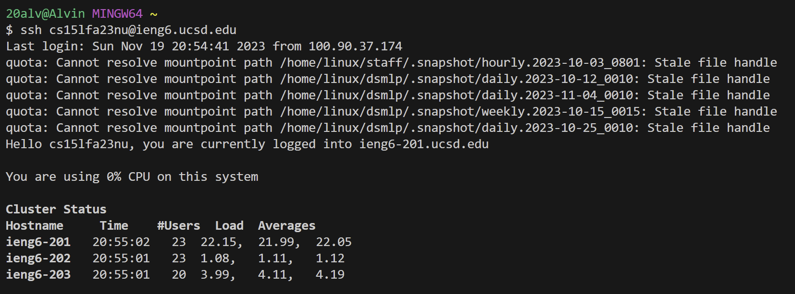
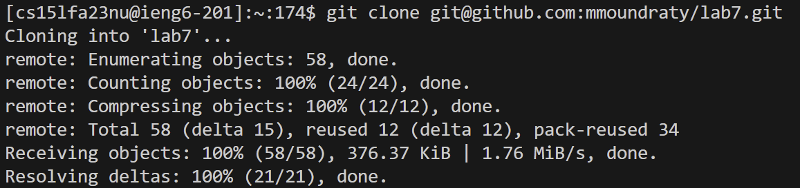
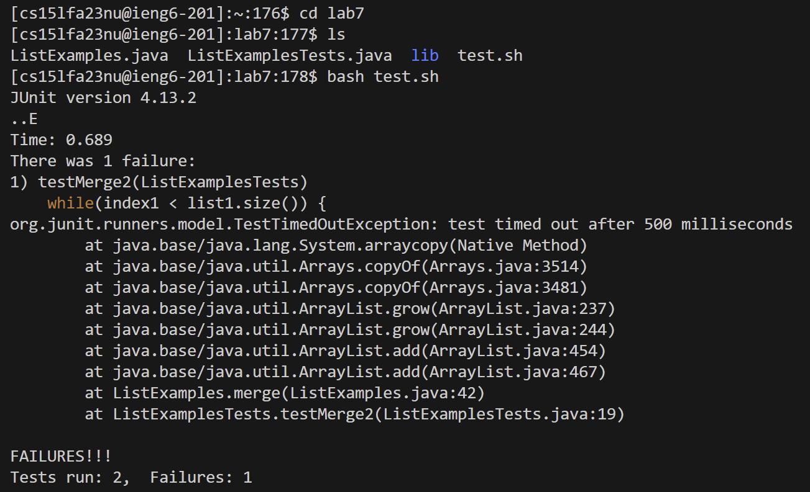
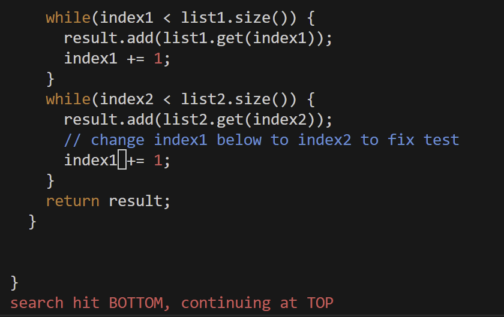
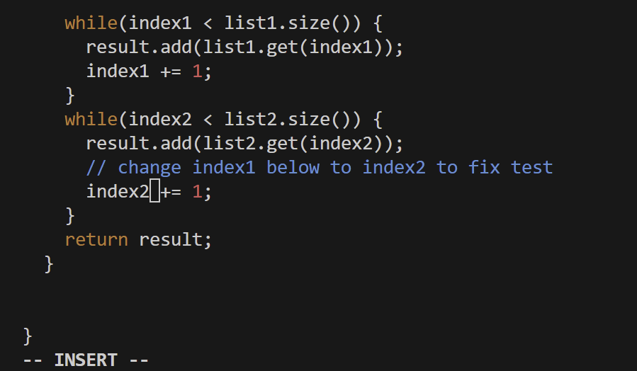
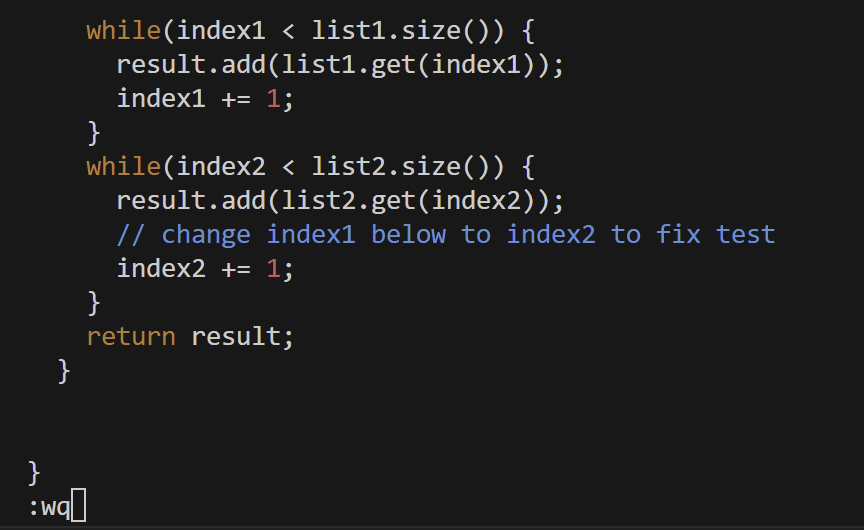
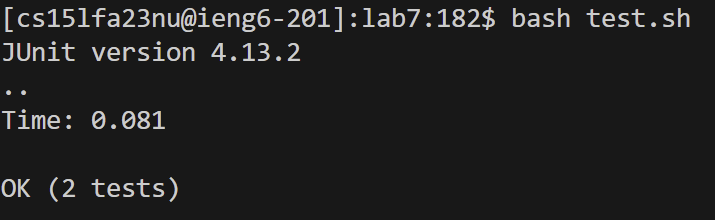
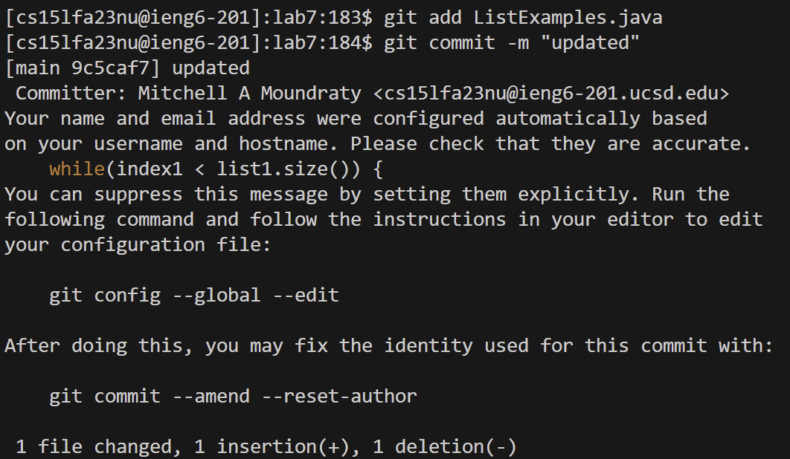

## Lab 4

ssh to your ieng 6 account. Like this: `ssh cs15lfa23nu@ieng6.ucsd.edu`

type git clone and paste your ssh key of your forked lab7. Like this: `git clone git@github.com:mmoundraty/lab7.git`

type `cd lab7`
type `bash.sh`

type `/change`
press `<enter>`
press `<j><l><l><l>`

press `<i>`
press `<backspace>`
type `<2>`

press the `<esc>` 
type `:wq`
press `<enter>`

press `<up><up><up><enter>` to save time typing bash test.sh

type `git add ListExamples.java`
type `git commit -m "updated"`

type `git push` to finish it off

![Image}
