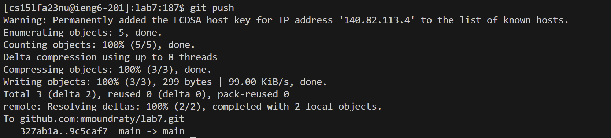

## Lab 4

ssh to your ieng 6 account. Like this: `ssh cs15lfa23nu@ieng6.ucsd.edu` this will log in to another terminal which is your ieng6 terminal.

type git clone and paste your ssh key of your forked lab7. Like this: `git clone git@github.com:mmoundraty/lab7.git` by cloning this you will be able to acces the directories and files from this git clone.

type `cd lab7` this will change your directory to lab7.
type `bash test.sh` you will see what tests has failed and see what line(s) has to be fixed. 

type `vim ListExamples.java` this command will let you edit the java file.
type `/change` this command will let you find the words in the java file that contains "change".
press `<enter>` to execute the command.
press `<j><l><l><l>` this will move your cursor down once and left 3 times to the variable that you want to edit.

press `<i>` this will take you to insert mode.
press `<backspace>` to delete the "1" in "index1"
type `<2>` this will make the variable correct since the bug was the variable being named index 1 instead of index2.

press the `<esc>` to exit out of insert mode.
type `:wq` this will save your vim edits.
press `<enter>` to execute the wq command.

press `<up><up><up><enter>` to save time typing bash test.sh

type `git add ListExamples.java` to save the changes in your ListExamples.java file.
type `git commit -m "updated"` which will save in your repository.

type `git push` which will upload your files in your local repository to a remote repository. 

