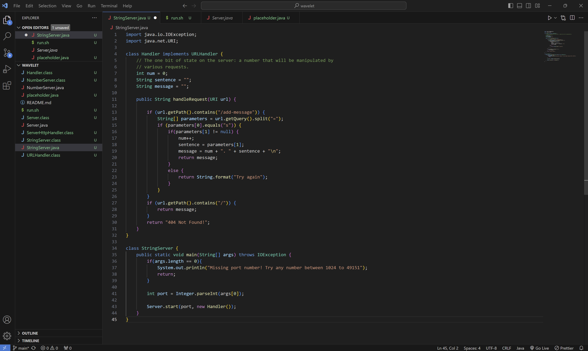
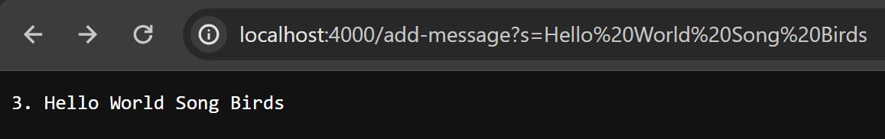
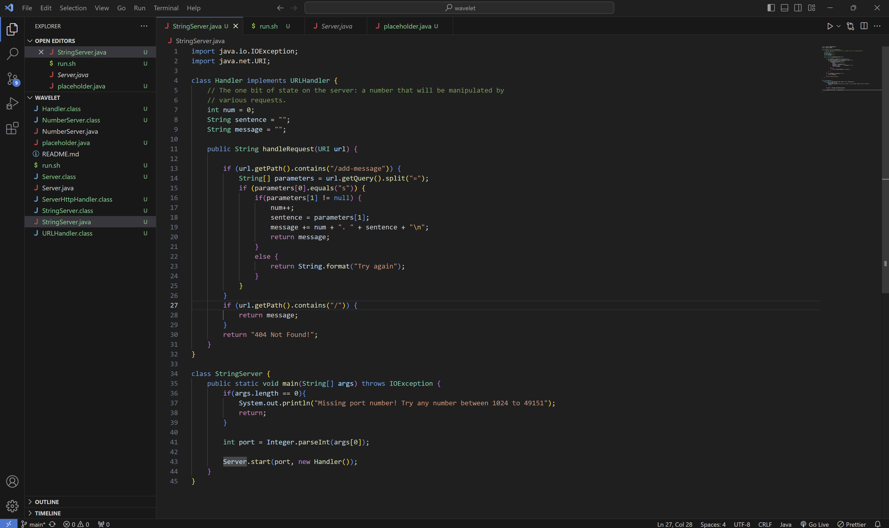
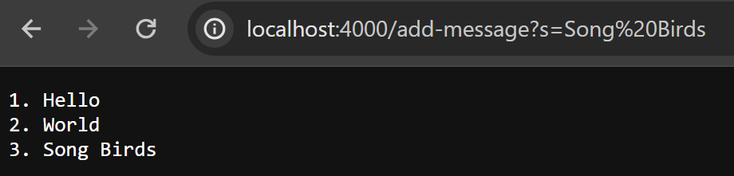
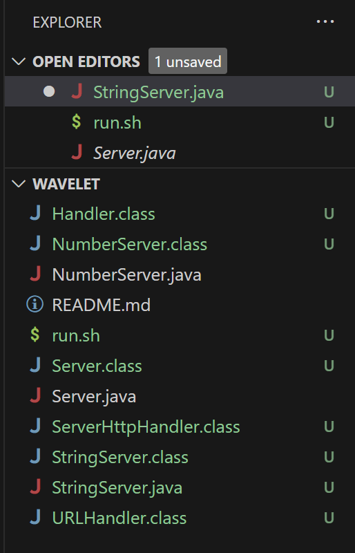
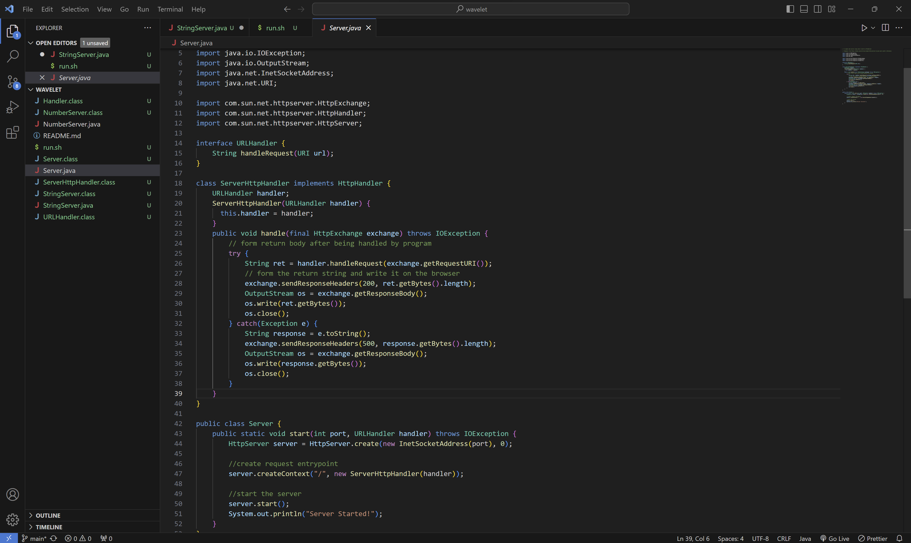
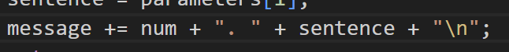

## Part 1

Student: Hello, I'm doing the code for the `handleRequest` method for the Lab Report 2 writeup and when I'm running the StringServer I only get one line of output instead of multiple lines. I think it might have to do with my variables in the handleRequest method when adding new input. Here is my code and the output it's giving:

Here is my buggy output:

TA: Consider your string variables, when entering data in your query think about why your previous inputs are being overwritten.

Student: Alright I will try that. I see that for my `message` variable that I needed to do `+=` instead of just `=` to my data that I am displaying since doing `=` only will overwrite the previous query inputs and shows why I'm not having new line of output in my web server.

Here is the fixed code:

Here is the fixed output now:

[Information needed about the setup]

Here is the file directory & structure that I need which is just `Server.java`, `run.sh`, and `StringServer.java`

Here are the contents of each file before fixing the bug.

Bash file:

StringServer Java file:

Server Java file:

The command line I triggered the bug was `http://localhost:4000/add-message?s=Hello`, `http://localhost:4000/add-message?s=World`, and `http://localhost:4000/add-message?s=Song Birds` or putting more than one input in the query that triggers the bug.

To fix the bug add `+=` for the `message` variable. By adding that to the variable you add the previous query inputs to the message inputs which will create new lines in the output of the web server instead of overwriting the previous inputs:

## Part 2

In the second half of the quarter what I thought was really interesting to learn
was using vim to edit my files. Learning vim, I learned that I can edit my code just from my terminal and that an
IDE is not the only thing that I can use to edit code with. I thought applying vim to my
skill demo was cool since I could access files quickly from the command line and edit
from there instead of going online in github and having to fork the files to my VS code.
