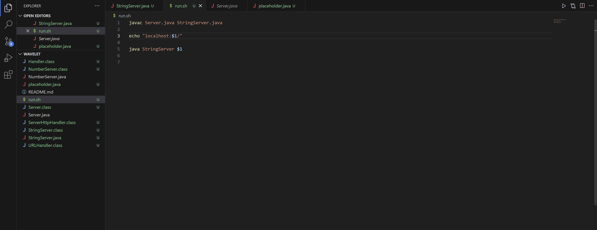

## Part 1

Student: Hello, I'm doing the code for the handleRequest method for the Lab Report 2 writeup and when I'm running the StringServer I only get one line of output instead of multiple lines do you know how I can fix this? Here is my code and the output it's giving:

TA: Hi, make sure for the variable that you are returning, you are adding your variable with previous messages instead of overwriting it.

Student: Alright I will try that.

Student: I see that for my message variable that I needed to do += instead of just = to my data that I am displaying.

## Part 2

In the second half of the quarter I was able to learn bash, jdb, and vim to efficiently debug my code.
I learned how to use bash to report errors in my code and used bash to report how to fix my code.
I also learned to efficiently debug my java code using jdb such as using the "stop at" command to find a breakpoint in my code where the errors are showing. 
What I thought was really cool was that I learned that I don't even need an IDE or even Notepad to edit my files, 
I can just edit files from my terminal with git commands and using vim.
I learned git commands to save my changes with just the command lines with git add and git commit instead of going to the github to save my changes.
I also learned how to apply jdb, vim, and git in lab for my ChatServer lab project.
